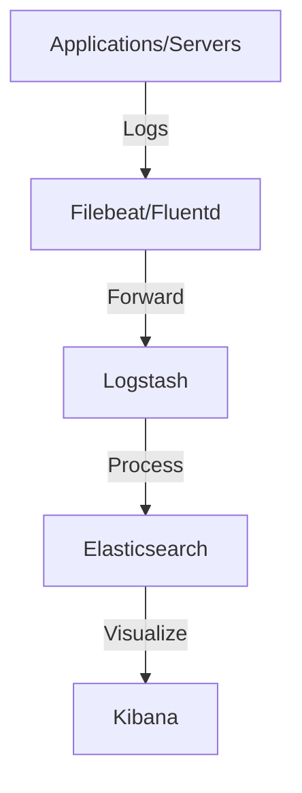

# ELFK Stack for Monitoring

The **ELFK stack** is a combination of open-source tools used for log aggregation, searching, visualization, and monitoring in cloud-native or DevOps environments. Here's what each letter stands for:

## E — Elasticsearch
- **What it is:** A distributed, RESTful search and analytics engine.
- **Role:** Stores and indexes logs and metrics, making them searchable and analyzable.
- **Use:** Central storage for logs and metrics collected from your infrastructure and applications.

## L — Logstash
- **What it is:** A data processing pipeline.
- **Role:** Collects, parses, and transforms logs and events before sending them to Elasticsearch.
- **Use:** Ingests logs from various sources (files, syslog, etc.), processes them (filtering, parsing), and forwards to Elasticsearch.

## F — Filebeat (or sometimes Fluentd)
- **What it is:** A lightweight log shipper (Filebeat) or log collector/forwarder (Fluentd).
- **Role:** Installed on servers to collect log files and forward them to Logstash or Elasticsearch.
- **Use:** Efficiently ships logs from your nodes to the central stack.

## K — Kibana
- **What it is:** A visualization and analytics platform.
- **Role:** Provides a web UI to search, analyze, and visualize data stored in Elasticsearch.
- **Use:** Dashboards, log searching, alerting, and monitoring.

---

## How the ELFK Stack Works for Monitoring

1. **Filebeat** (or Fluentd) runs on your servers, collecting log files (from apps, containers, system logs, etc.).
2. Filebeat forwards logs to **Logstash** (for processing) or directly to **Elasticsearch**.
3. **Logstash** (if used) parses, enriches, and transforms logs, then sends them to **Elasticsearch**.
4. **Elasticsearch** stores and indexes all logs, making them searchable.
5. **Kibana** provides dashboards and search capabilities for users to monitor, analyze, and visualize logs and metrics.

---

## What Can You Monitor with ELFK?
- Application logs (errors, warnings, info)
- System logs (auth, syslog, dmesg, etc.)
- Kubernetes logs (from pods, nodes)
- Cloud infrastructure logs (AWS CloudTrail, etc.)
- Custom metrics and events

---

## Why Use ELFK for Monitoring?
- **Centralized log management:** All logs in one place.
- **Powerful search:** Quickly find issues across your infrastructure.
- **Visualization:** Build dashboards for real-time monitoring.
- **Alerting:** Set up alerts for specific log patterns or metrics.
- **Scalability:** Handles large volumes of data.

---

## Summary Diagram



---

# Kubernetes Probes: Liveness, Readiness, Startup

Kubernetes uses probes to determine the health and readiness of a container running in a Pod. There are three main types of probes:

## 1. Liveness Probe
- **Purpose:** Checks if your application is still running.
- **If it fails:** Kubernetes will restart the container.
- **When to use:** If your application can get stuck or deadlocked and needs a restart to recover.

## 2. Readiness Probe
- **Purpose:** Checks if your application is ready to serve traffic.
- **If it fails:** The Pod is removed from Service endpoints (it won't receive traffic).
- **When to use:** If your app needs time to warm up, load data, or connect to dependencies before it can serve requests.

## 3. Startup Probe (Kubernetes 1.16+)
- **Purpose:** Checks if your application has started up successfully.
- **If it fails:** The container is killed and subject to its restart policy.
- **When to use:** If your app has a slow startup and you don't want liveness/readiness probes to interfere during this time.

## How to Use Them Together
- **Startup Probe:** Used only at the beginning, to give your app time to start. Once it succeeds, liveness and readiness probes take over.
- **Liveness Probe:** Used throughout the container's life to check if it should be restarted.
- **Readiness Probe:** Used throughout the container's life to check if it should receive traffic.

## Probe Types (How They Work)
- **HTTP GET:** Makes an HTTP request to a specified endpoint (e.g., `/healthz`).
- **TCP Socket:** Tries to open a TCP connection on a specified port.
- **Exec Command:** Runs a command inside the container; success is exit code 0.

## Example YAML Snippet

```yaml
livenessProbe:
  httpGet:
    path: /healthz
    port: 8080
  initialDelaySeconds: 10
  periodSeconds: 10

readinessProbe:
  httpGet:
    path: /ready
    port: 8080
  initialDelaySeconds: 5
  periodSeconds: 5

startupProbe:
  httpGet:
    path: /startup
    port: 8080
  failureThreshold: 30
  periodSeconds: 10
```

## Summary Table

| Probe Type     | Purpose                | When to Use                        | Action on Failure         |
|----------------|------------------------|-------------------------------------|--------------------------|
| Liveness       | Is app running?        | App may hang or deadlock           | Restart container        |
| Readiness      | Is app ready?          | App needs warmup or dependencies   | Remove from endpoints    |
| Startup        | Has app started?       | App has slow startup               | Restart container        |

--- 